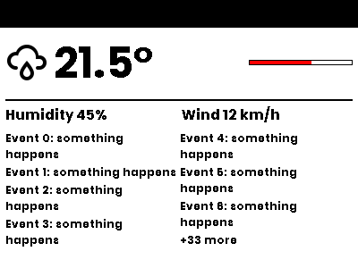
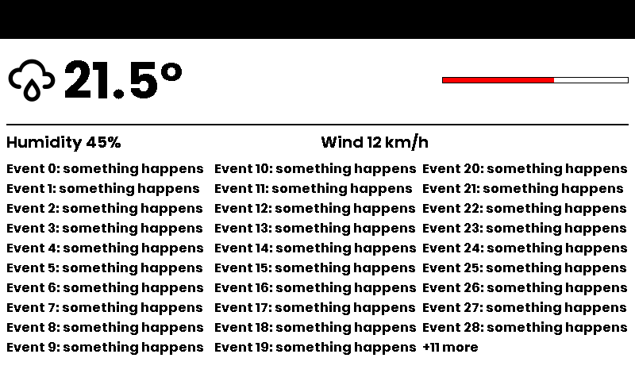

# ODL Layout

Layout compiler for the OpenDisplay Language: containers in, positioned ODL elements out

[](https://pypi.org/project/odl-layout/)
[](https://pypi.org/project/odl-layout/)
[](LICENSE)
[](https://github.com/OpenDisplay/odl-layout/actions/workflows/test.yml)
[](https://github.com/OpenDisplay/odl-layout/actions/workflows/lint.yml)
[](https://github.com/astral-sh/ruff)
[](https://mypy.readthedocs.io/)

`odl-layout` turns `row` / `column` / `grid` / `stack` / `list` containers into plain, pixel-positioned
[ODL](https://opendisplay.org/protocol/open-display-language.html) elements for
[odl-renderer](https://github.com/OpenDisplay/odl-renderer). One payload adapts to every display size, and the
renderer stays pixel-exact: the output is ordinary ODL you can print, diff and hand-edit.

```
payload with containers ──odl_layout.layout()──► flat ODL list ──odl_renderer.generate_image()──► image
```

| 400×300 | 800×480 |
|---|---|
|  |  |

*The same payload at both sizes. Text wraps, and the event list picks its column count and reports "+N more" for what it hides.*

## Installation

```bash
pip install odl-layout
```

## Quick start

```python
from odl_layout import layout
from odl_renderer import generate_image

payload = [
    {"type": "column", "padding": "md", "gap": "md", "children": [
        {"type": "text", "value": "21.5°", "size": "xxl"},
        {"type": "row", "gap": "md", "children": [
            {"type": "icon", "value": "weather-rainy", "size": "lg"},
            {"type": "text", "value": "Rain later", "grow": 1},
            {"type": "progress_bar", "progress": 60, "w": "30%", "h": "md"},
        ]},
    ]},
]

elements = layout(payload, 800, 480)                  # sync, plain dicts in and out
image = await generate_image(800, 480, elements)
```

`layout()` loads font files for measurement. From async code, run it in an executor.

## Containers

| Type | Children key | Options |
|---|---|---|
| `column` | `children` | `gap`, `padding`, `justify` (main axis), `align` (cross axis, default `stretch`) |
| `row` | `children` | same as `column`; `align` defaults to `center` |
| `stack` | `children` | children overlap; `align` / `valign` (default `stretch`); a child with `position: absolute` is placed at its `x` / `y` relative to the stack |
| `grid` | `children` | `cols`, `gap`; a child may set `span`. Rows share spare height so tiles fill the grid |
| `list` | `items` | flows items into up to `max_cols` columns (best fit; or a fixed `cols`), hides items that don't fit; `overflow_counter: true` adds a "+N more" line (`overflow_text`, `overflow_size`) |

`justify`: `start` · `center` · `end` · `space-between`. `align` / `align_self`: `start` · `center` · `end` · `stretch`.
`padding`: one value, `[vertical, horizontal]` or `[top, right, bottom, left]`.
`background`, `border`, `border_width` and `radius` on a container paint a rectangle behind its children.

### Sizing any node

| Key | Meaning |
|---|---|
| `w`, `h` | px, `"N%"` of the parent's content box, or `auto` (content size) |
| `grow` | share of leftover main-axis space (weights); `spacer` is an empty node with `grow: 1` |
| `align_self` | overrides the parent's `align` for this child |

These are `w` / `h`, not `width` / `height`, because `width` already means stroke width on renderer
elements such as `rectangle`, `line` and `progress_bar`.

### Size tokens

`size` (text, icon), `gap`, `padding` and `radius` accept `xs` `sm` `md` `lg` `xl` `xxl`. Each token resolves by
the canvas's short side, so one design scales across displays:

| Size class | Short side | Example | Text `md` | Space `md` |
|---|---|---|---|---|
| small | ≤ 300 | 400×300 | 15 | 6 |
| medium | ≤ 600 | 800×480 | 20 | 8 |
| large | > 600 | 1972×1404, 1200×1600 | 40 | 16 |

Raw pixel values always work too.

### Leaves

Any of these renderer elements can go inside a container. Layout fills in the geometry:
`text`, `multiline`, `icon`, `icon_sequence`, `qrcode`, `dlimg`, `rectangle`, `ellipse`, `progress_bar`, `plot`,
`line` (`vertical: true` for a divider in a row), `circle`, `arc`, `polygon` (points local to the box, `%` allowed).

Text extras: `clamp: N` limits the number of lines (ending in "..."), `truncate: true` keeps a single line, and
`align: center|right` aligns the text inside its box. Text with `parse_colors` is measured but not pre-wrapped.

`diagram`, `debug_grid` and `rectangle_pattern` only work at the top level.

## Mixing with plain ODL

Containers can sit next to ordinary elements in the same payload:

1. **Paint order is payload order.** A container is replaced in place by its elements.
2. **Plain top-level elements pass through untouched** and stay canvas-absolute. A top-level container fills the
   canvas unless you give it a region: `x`, `y`, `w`, `h` (px or %), or `right` / `bottom` insets.
3. **Inside a container, the layout owns geometry.** An `x` / `y` / `x_start` set on a child is overwritten, with a
   warning. To position something freely inside a region, use `stack` with a `position: absolute` child.
4. **Implicit y-flow continues below a container.** A `text` / `multiline` / `line` without `y` right after a container
   starts below it. Use `h: auto` on the container so it doesn't fill the canvas.
5. **`visible: false` children take no space.**

```yaml
payload:
  - type: rectangle          # hand-placed header
    x_start: 0
    y_start: 0
    x_end: 100%
    y_end: 10%
    fill: black
  - type: column             # laid out below it
    y: 10%
    padding: md
    gap: md
    children:
      - type: text
        value: "{{ states('sensor.outdoor_temp') }}°"
        size: xxl
      - type: list
        grow: 1
        max_cols: 3
        overflow_counter: true
        items:
          - type: text
            value: Dentist 14:00
          - type: text
            value: Groceries
```

## Home Assistant integrations

Template rendering happens first, so layout measures the real values. Pass the post-rotation canvas size:

```python
elements = await hass.async_add_executor_job(layout, call.data["payload"], gen_width, gen_height, font_dirs)
img = await generate_image(width=gen_width, height=gen_height, elements=elements, font_dirs=font_dirs, ...)
```

## Development

```bash
uv sync --all-extras
uv run pytest
uv run prek run --all-files   # ruff, ruff-format, mypy
```

During development, `odl-renderer` resolves to the sibling checkout `../odl-renderer` (see `[tool.uv.sources]`).
